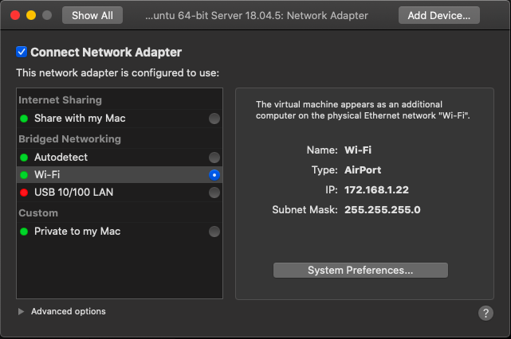
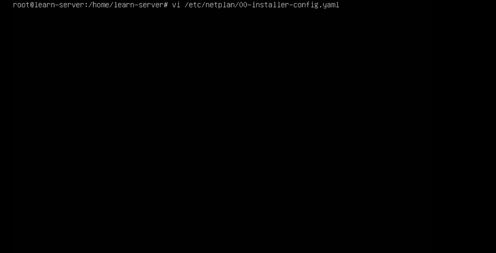
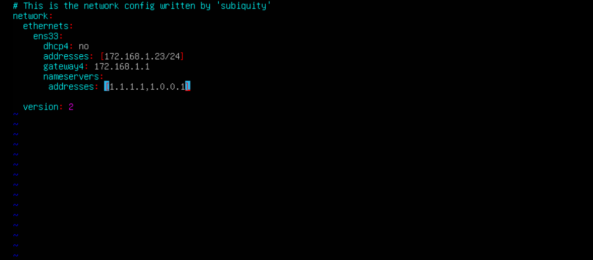
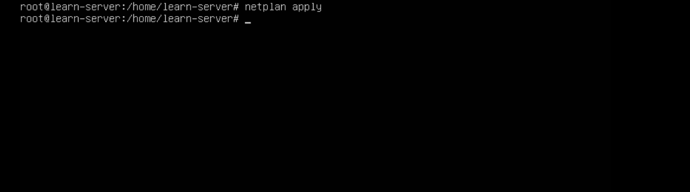
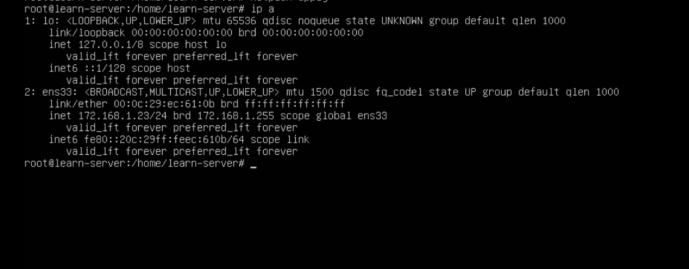

# VMWARE SETUP NETWORK 

1. Ubah network interfaces virtual mesin dari net ke bridge 

2. Setting ip static pada virtual mesin menggunakan netplan 

3. Masukan IP addres, gateway, dan DNS ke virtual mesin, jika sudah jalankan perintah netplan apply untuk menjalankan proses tersebut 

4. Jika berhasil pastikan ip address yang sudah dibuat sudah sesuai, lalu tes jaringan virtual mesin sudah berhasil mendapatkan internet

