# VMWARE INSTALL APPLICATION 

1. Update dan upgrade package ubuntu server 
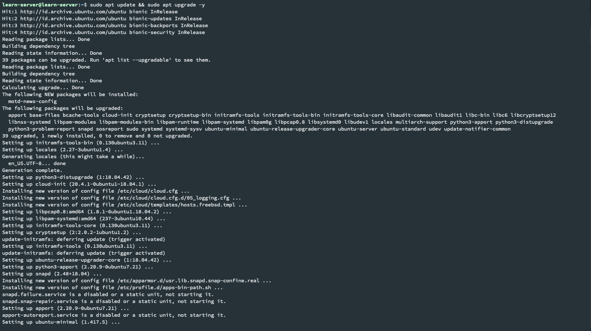

2. Install NGINX sebagai webserver, lalu buat hidupkan service nginx jika restart akan otomatis menyala
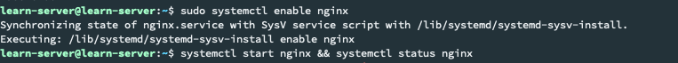

3. Setelah itu jalankan service nginx, lalu check status service nginx ,dan pastikan virtual server sudah dapat menggunakan nginx
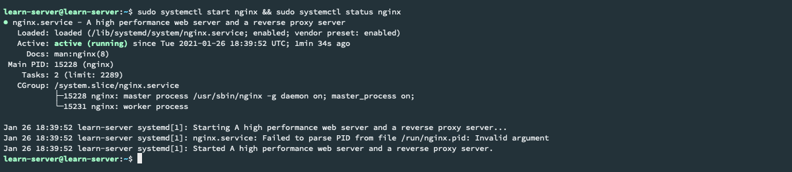
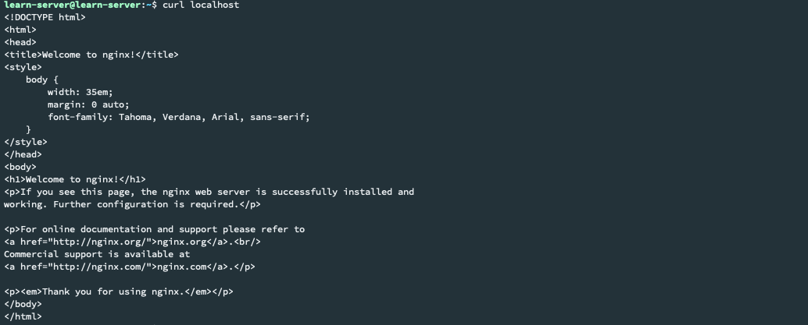

4. Install package nodejs versi 10   

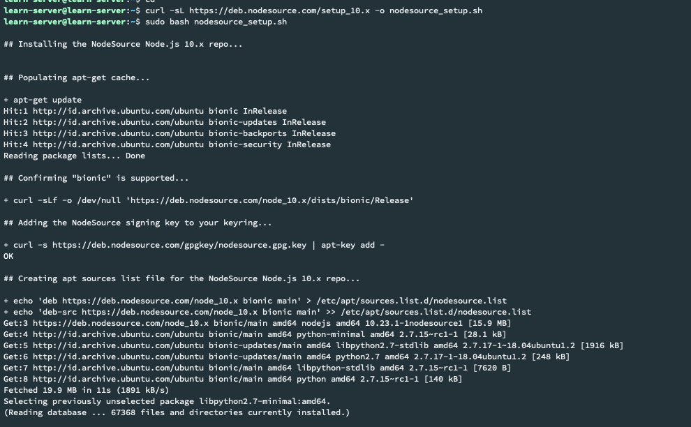

5. Pastikan Versi nodejs yang sudah terinstall menggunakan versi 10 
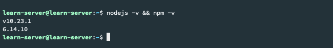

6. Lalu clone aplikasi yang akan di deploy menggunakan git, setelah berhasil di clone masuk ke dalam folder tersebut 
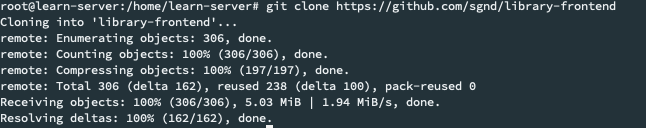

7. Deploy aplikasi tersebut menggunakan command npm install, lalu npm start untuk menjalankan applikasi tersebut  
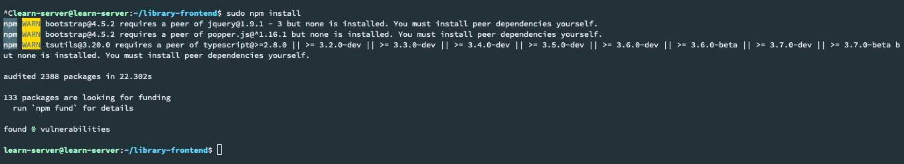
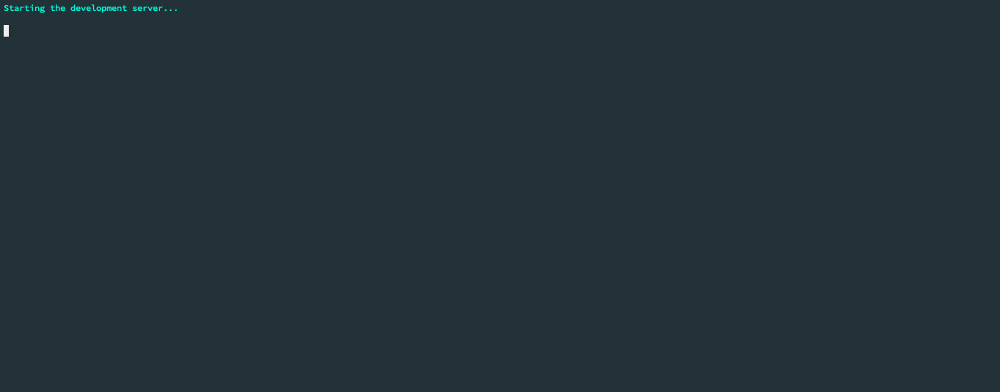
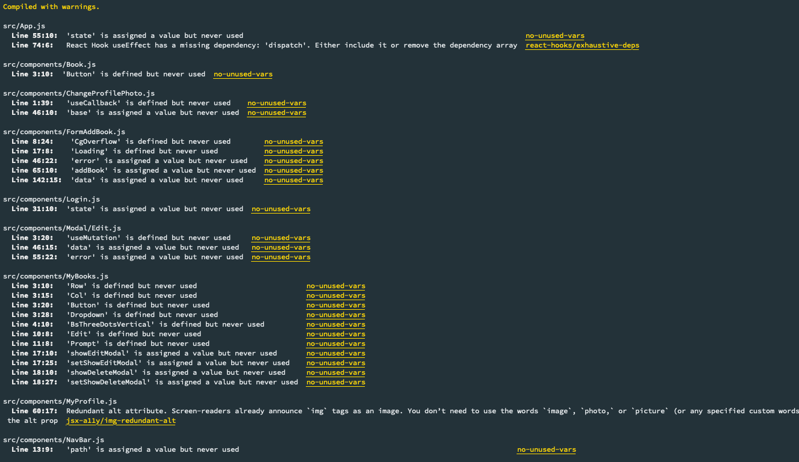

8. Jika sudah terinstall dan dijalankan, akses aplikasi di web browser dengan ip address virtual mesin dan port 3000
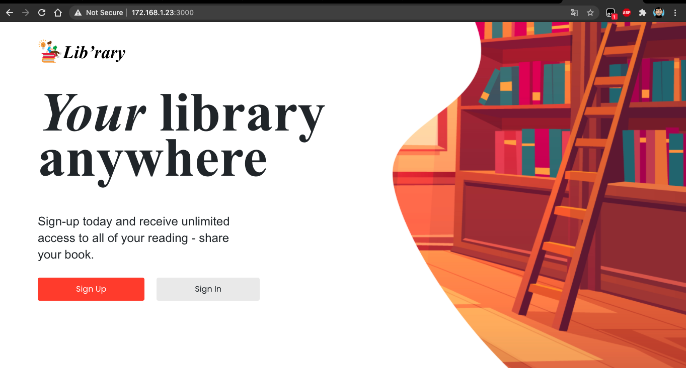

