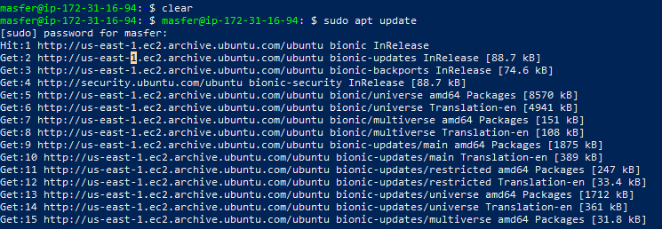
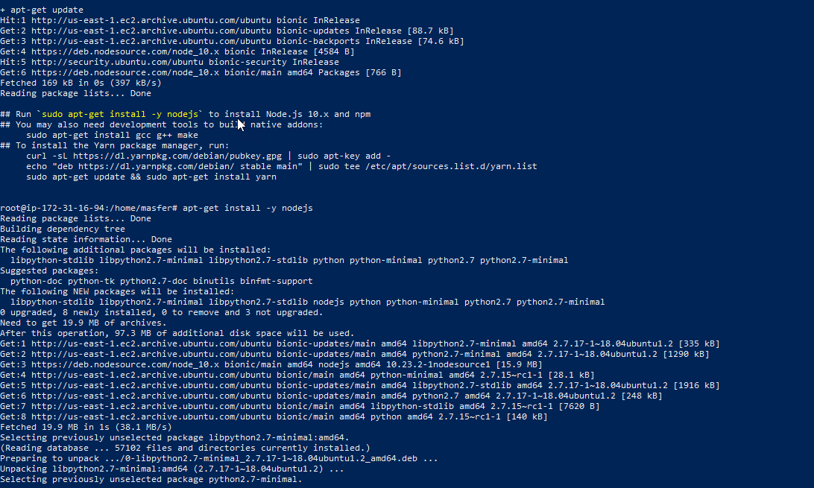
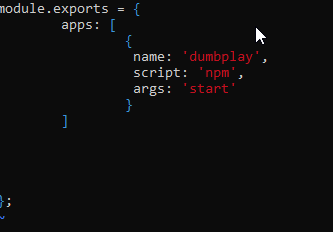
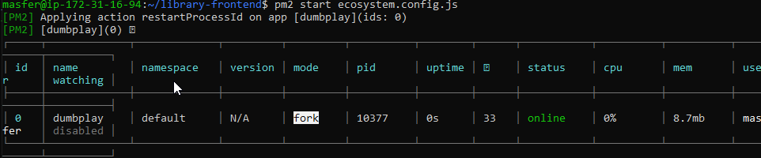
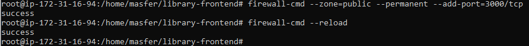
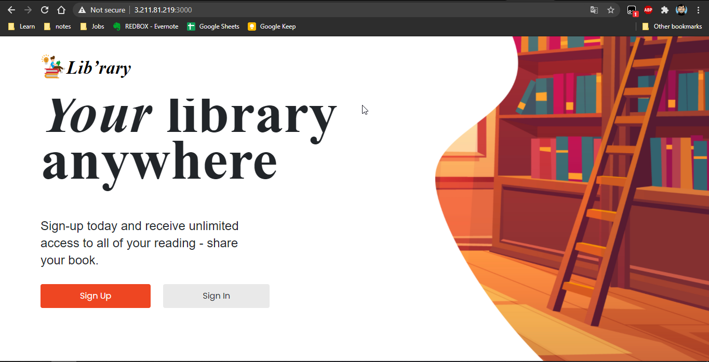

# AWS-SERVER FOR APPLICATION

1. Update dan upgrade sistem untuk server application
   
2. install node js 10 di server application
   
3. setellah proses install git clone apps di https://github.com/sgnd/library-frontend , lalu deploy aplikasi tersebut menggunakan perintah npm install dan npm start
4. Karena pada saat proses npm start tidak dapat melakukan secara otomatis, maka untuk mendeploy aplikasi nodejs kita menambahkan pm2 agar service dapat di start atau di stop di server
   
5. kemudian open port 3000 di server agar dapat dipanggil dari luar

