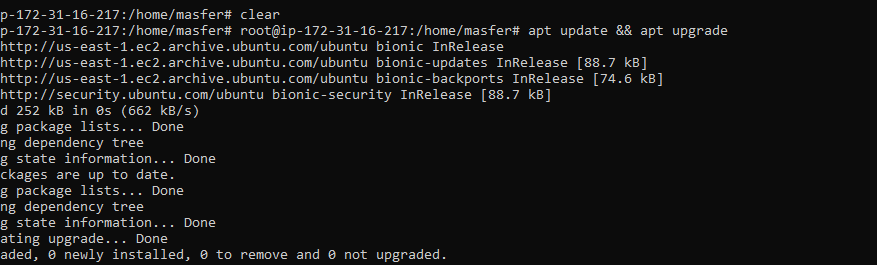
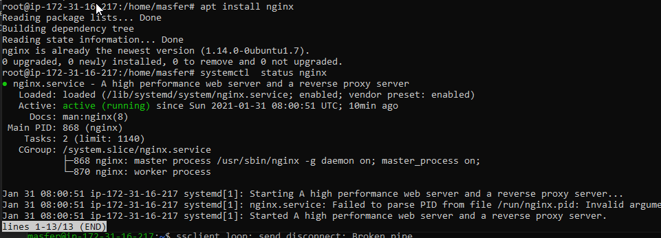
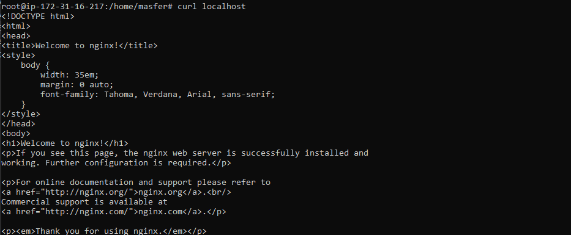
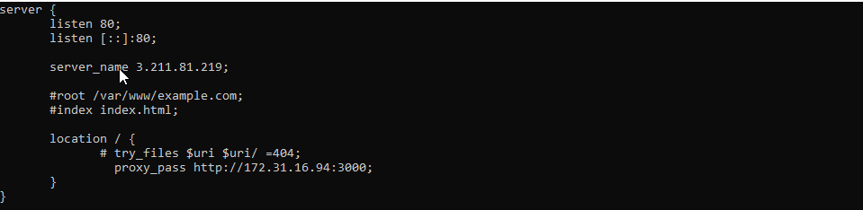
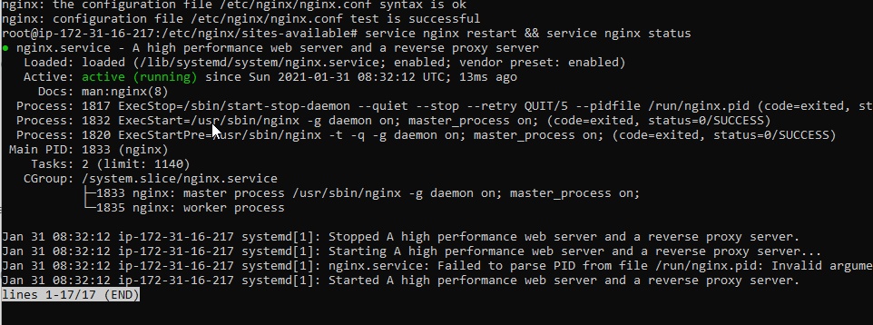

# AWS-SERVER REVERSE PROXY

1. Update dan upgrade library os packages
   
2. install nginx dan check service nginx
   
3. Test nginx apakah sudah berhasil terinstall menggunakan command curl
   
4. Membuat file serv.conf pada directory nginx di `etc/sites-available/`
   
5. jika sudah jalankan file.conf dengan symbolic link ke directory /etc/sites-enable/ dengan perintah `ln -s /etc/nginx/sites-available/serv.conf /etc/nginx/sites-enabled/`
   
6. setelah itu test konfigurasi nginx yang sudah dibuat dengan perintah `nginx -t` lalu restart service nginx dan chech statusnya
   
7. akses ke browser dengan ip public apakah aplikasi berhasil
   
