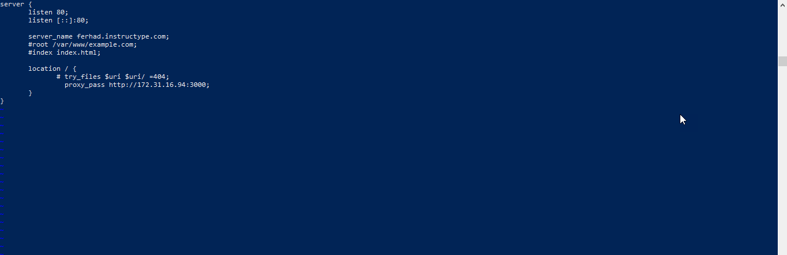

# AWS-CUSTOM DOMAIN

1. Login ke account cloudflare yang sudah diberikan,
   
2. Masukan nama subdomain dengan ketentuan type record A, nama (ferhad), ipv4 address (ip public elastic)
   
3. Rubah file.conf di nginx menggunakan nama domain yang sudah didaftarkan
   
4. akses nama domain pada web browser
   
