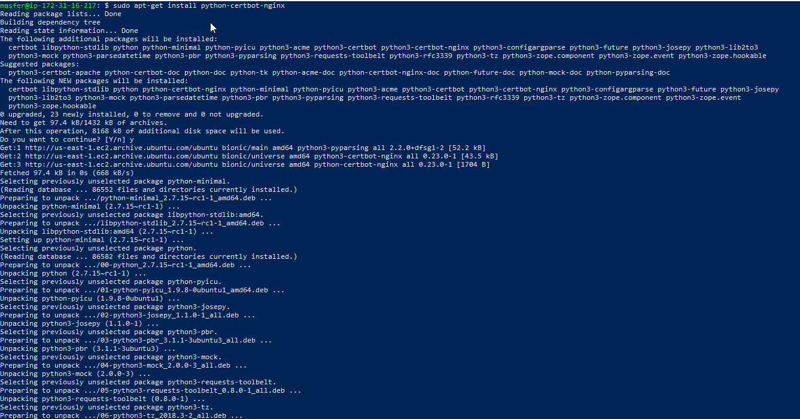
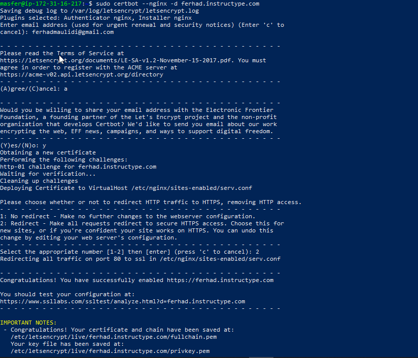

# AWS-SSL-CONFIGURATION

1. Install repo letstencypted pada ubuntu server
   
2. jalan certbot untuk menggenerate certificated ssl
   
3. rubah settingan .conf si /etc/nginx/sites-available/serv.conf pada nginx
   
4. check configurasi nginx & restart service nginx
   
5. check url site apakah sudah dapat https
6. 
