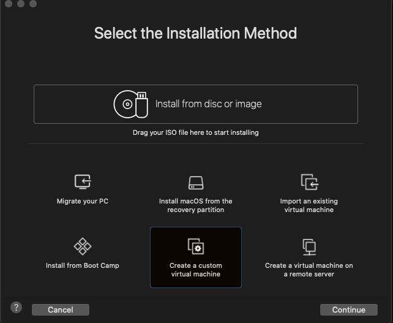

# Instalasi Ubuntu Server 18.04 pada VMWare Fusion

1. Buat sebuah virtual mesin pada vmware

2. Mengatur ukuran ram yang akan digunakan

3. Membuat hardisk virtual beserta mengalokasikan ukuran hardisk sebesar 15GB

4. Menambahkan file iso kedalam disk virtual untuk nantinya di install 

5. klik install ubuntu server dan ikuti langkah selanjutnya hingga sampai tahap storage configuration

6. untuk konfigurasi storage digunakan 1GB untuk swap dan 14GB untuk root

7. klik done terus sampai tahap menentukan nama dan user server dan install openssh

8. tunggu sampai instalasi selesai, kemudian restart vm
© 2021 GitHub, Inc.
Terms
Privacy
Security
Status
Docs
Contact GitHub
Pricing
API
Training
Blog
About
