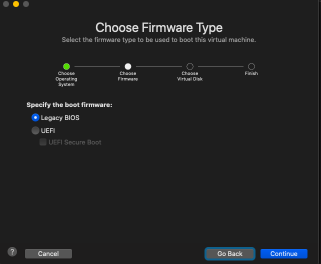

# Instalasi Ubuntu Server 18.04 pada VMWare Fusion

1. Buat sebuah virtual mesin pada vmware

2. Tentukan sistem operasi yang akan digunakan (contoh ubuntu server 18.04)

3. Pilih bootable bios untuk mesin virtual

4. Tentukan spesifikasi untuk mesin virtual 

5. Lanjutkan installasi sampai pada proses storage configuration

6. Untuk  konfigurasi storage digunakan adalah swap 40gb, boot 1GB, root 15 GB

7. Tentukan nama dan password untuk sistem operasi yang akan digunakan 

8. Lanjutkan hingga step berikutnya sampai proses installasi selesai, jika sudah reboot sistem operasi lalu akan masuk ke halaman login ubuntu server

