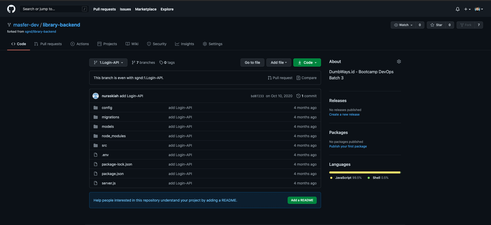
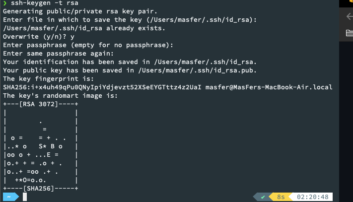
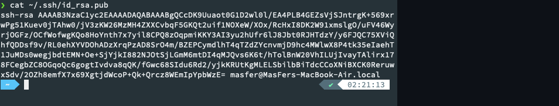
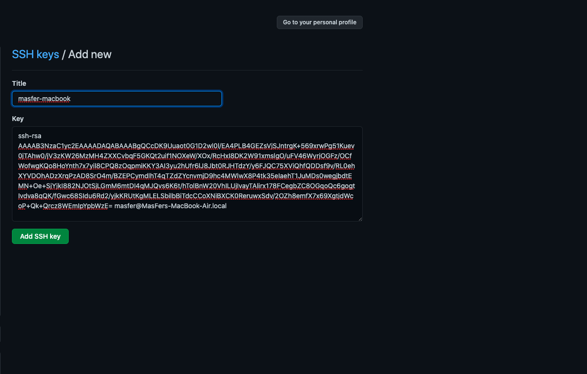
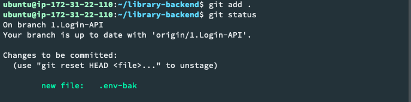
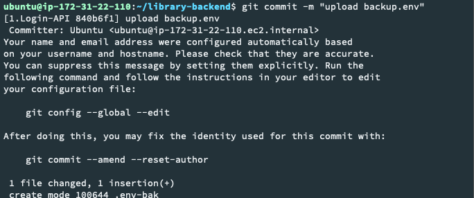
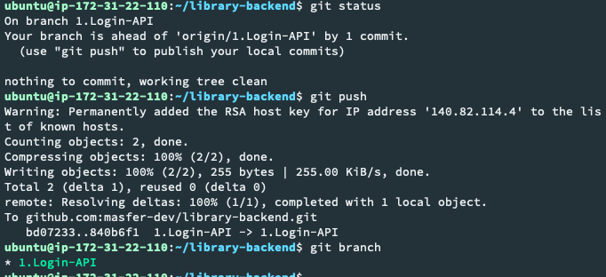

# Install Git and SSH Key

1. Menyalin sebuah project pada alamat æhttps://github.com/sgnd/library-backend" ke dalam account github 

2. Membuat ssh key untuk account github agar ketika maelakukan proses penyalinan ataupun mengclone tidak meminta credential login 

3. Jika sudah dibuat copy file id_rsa.pub ke dalam pengaturan ssh pada account git 

4. Setelah proses copy id_rsa.pub, maka selajurnya mula memastikan bahwa proses git ke repository git hub sudah dapat berjalan dengan smooth 

