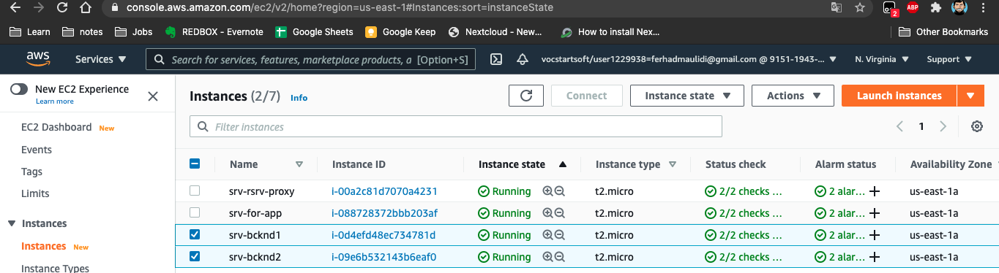
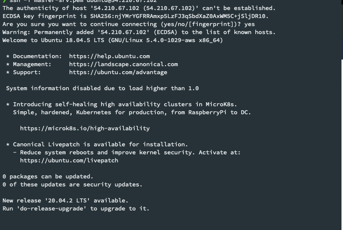
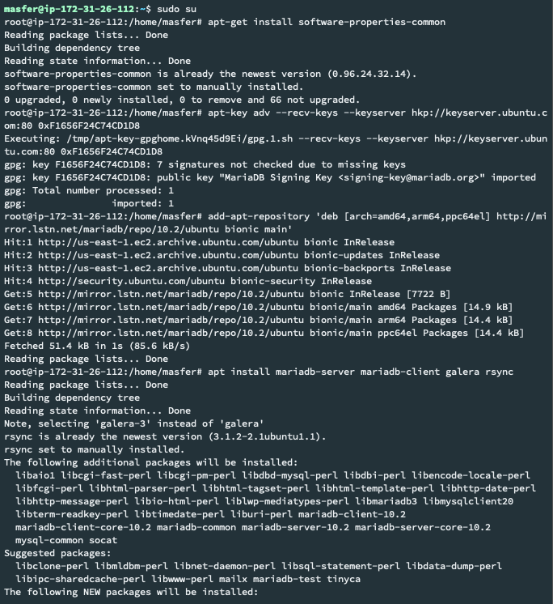
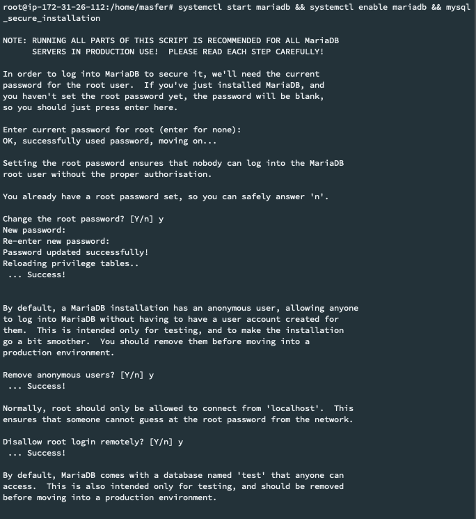
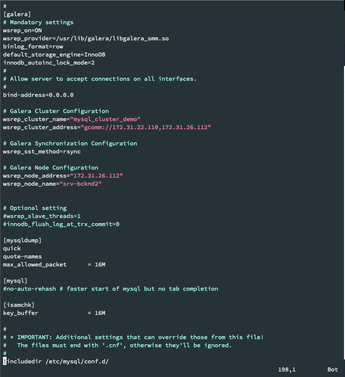
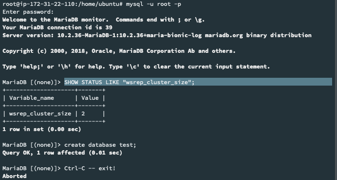

# SETUP DATABASE
1. Membuat 2 instance di aws untuk server backend & database

2. Update package ubuntu server 

3. install mariadb 10.2 & galera sebagai clustering database pada dua node server

4. setup user password untuk maariadb sebgai root dengan perintah mysql_secure_installation

5. config galera pada dua node server pada file /etc/mysql/my.cnf

6. test hasil clustering database di kedua nodes dengan perintah "SHOW STATUS LIKE "wsrep_cluster_size";

